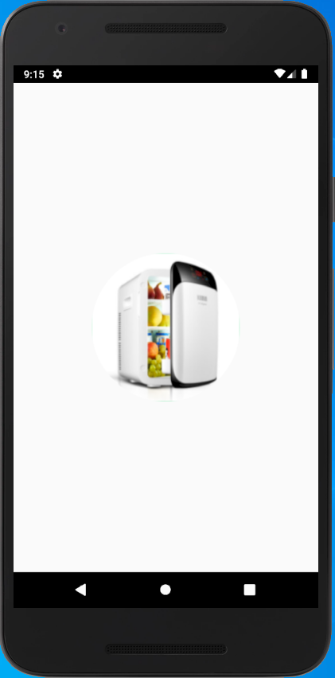
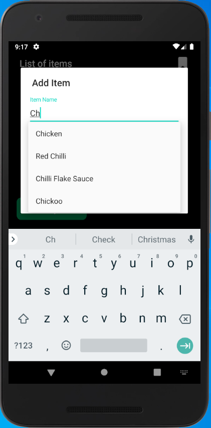
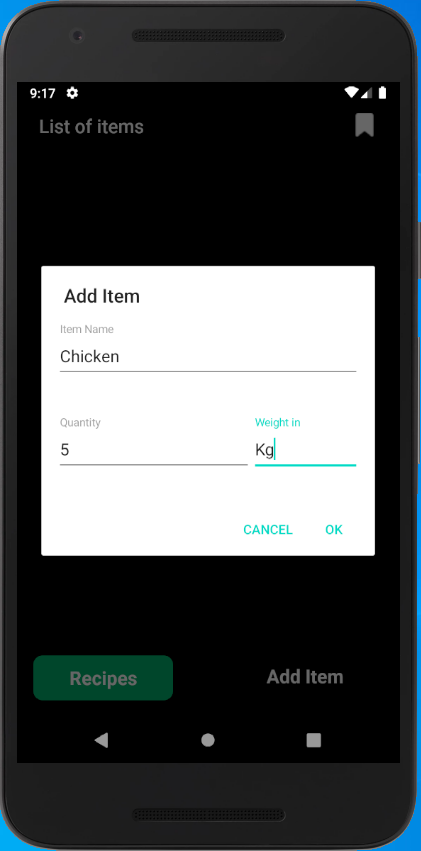
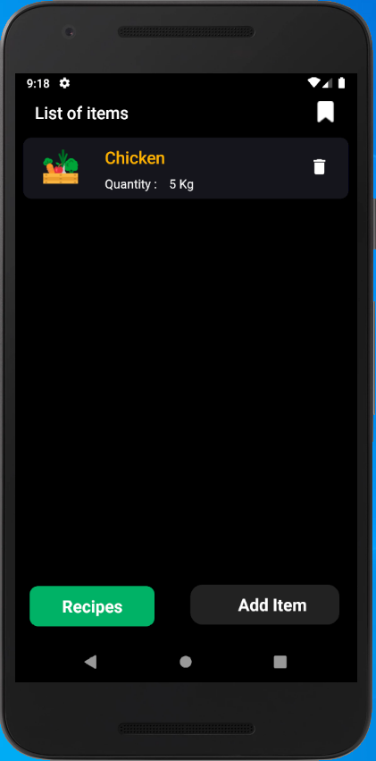
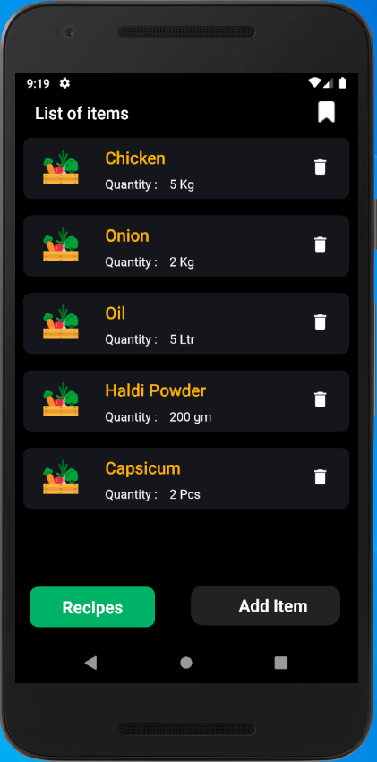
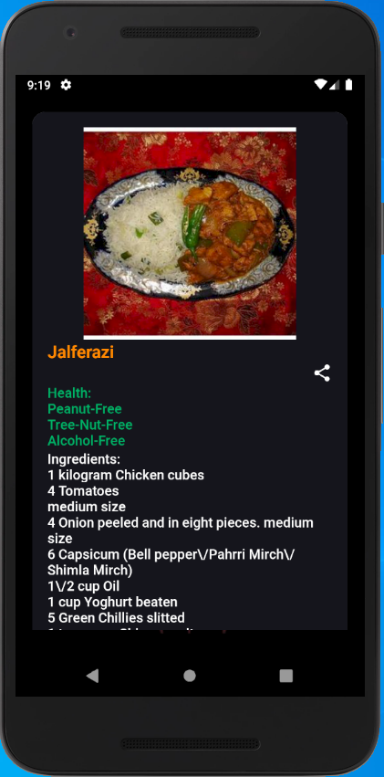

## Whats-In-Fridge
> Android Application that will provide recipes to the users based on the list of available items in the fridge with them. Based on that list of items different list of recipes will be shown to the user and user can choose any one of them start cooking.

## Introduction
Each recipe provides you with all the information, from the ingredients required to each step required to cook the different parts of the dish. These applications are generally used by people who want to try to make some new dish, or by people who live all by themselves, or by working people who are always short on time. Even though there has been such a huge advancement in technology, all these applications provide you with the ingredients required, and you must go and buy the ingredients that are not available to you currently.

## Snapshot of the App

